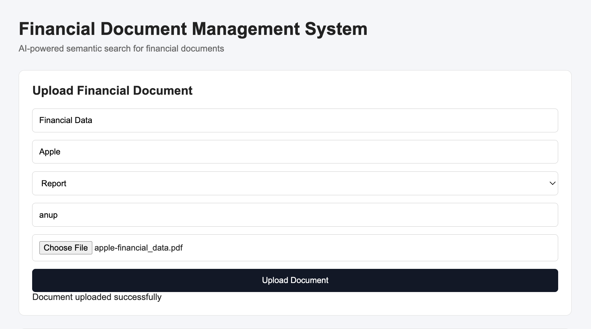
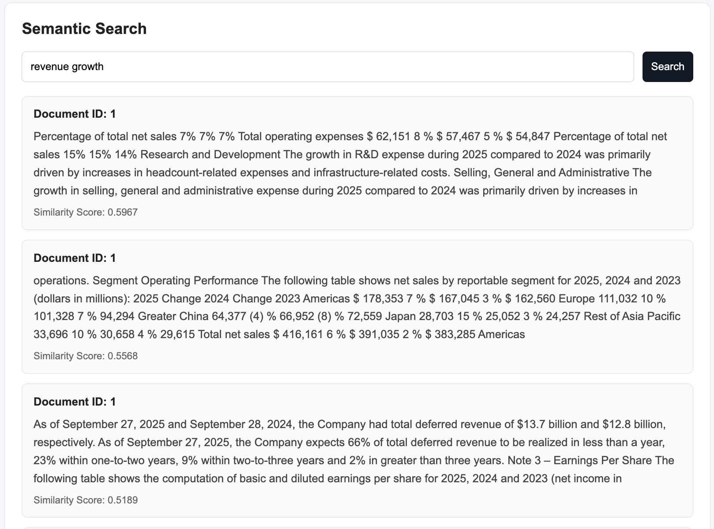
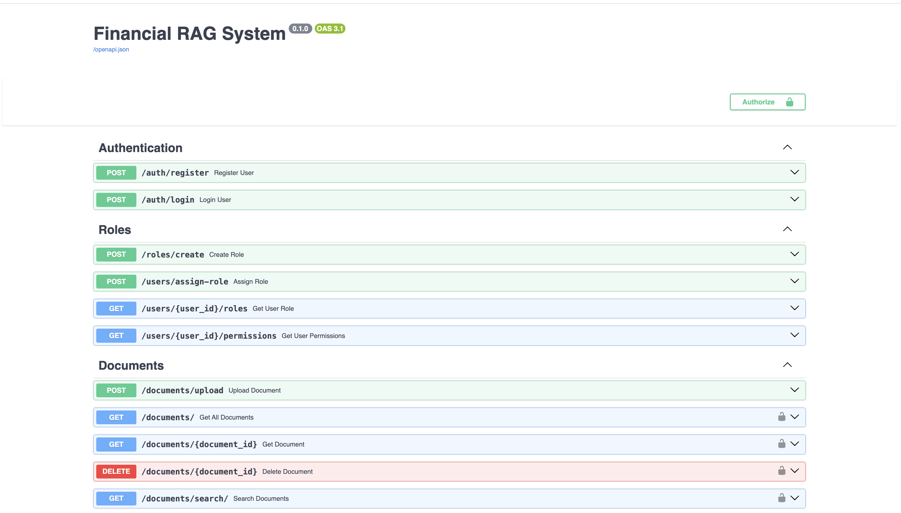

# Financial RAG System

This is a financial document management and semantic search system built using FastAPI and ChromaDB.

In this project, I worked on uploading PDF documents, storing embeddings and performing semantic search using a RAG pipeline.

Features:

* JWT authentication
* Role based access
* PDF upload
* Semantic search
* ChromaDB integration
* Reranking search results
* Simple frontend dashboard
* Swagger API testing

Tech used:

* FastAPI
* SQLite
* ChromaDB
* Sentence Transformers
* LangChain
* HTML/CSS/JavaScript

Project structure:

app/

* models
* routes
* schemas
* rag
* utils

templates/
static/

How to run:

Clone the repository

```bash
git clone https://github.com/Anupthor007/financial-rag-system
```

Move into the folder

```bash
cd financial-rag-system
```

Create virtual environment

```bash
python -m venv venv
```

Activate environment

```bash
venv\Scripts\activate
```

Install requirements

```bash
pip install -r requirements.txt
```

Run server

```bash
uvicorn app.main:app --reload
```

Open frontend:

```text
http://127.0.0.1:8000
```

Open Swagger docs:

```text
http://127.0.0.1:8000/docs
```
Swagger can be used to directly test document upload and semantic search APIs.

Semantic search flow:

1. Upload PDF
2. Extract text
3. Generate embeddings
4. Store vectors in ChromaDB
5. Perform semantic search

Notes:

* Uploaded PDFs are stored locally
* Swagger can be used for backend API testing
* ChromaDB is used as vector database

## Screenshots

### Dashboard



### Semantic Search



### Swagger API

